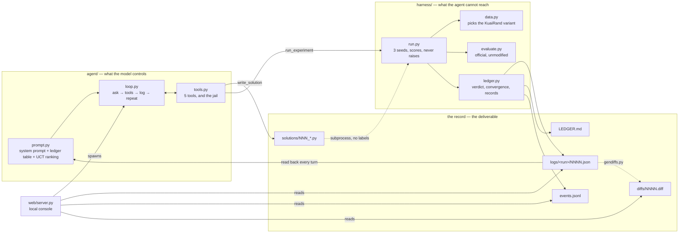
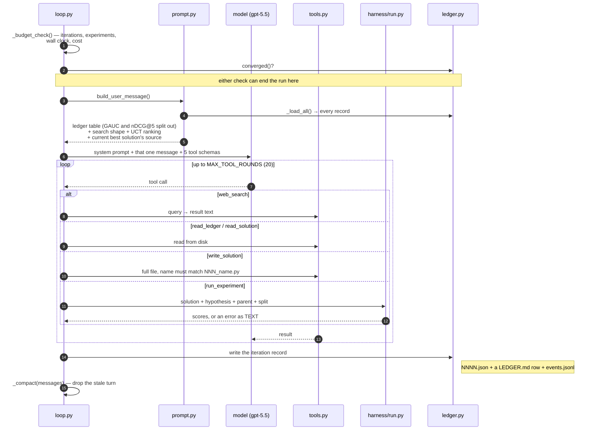
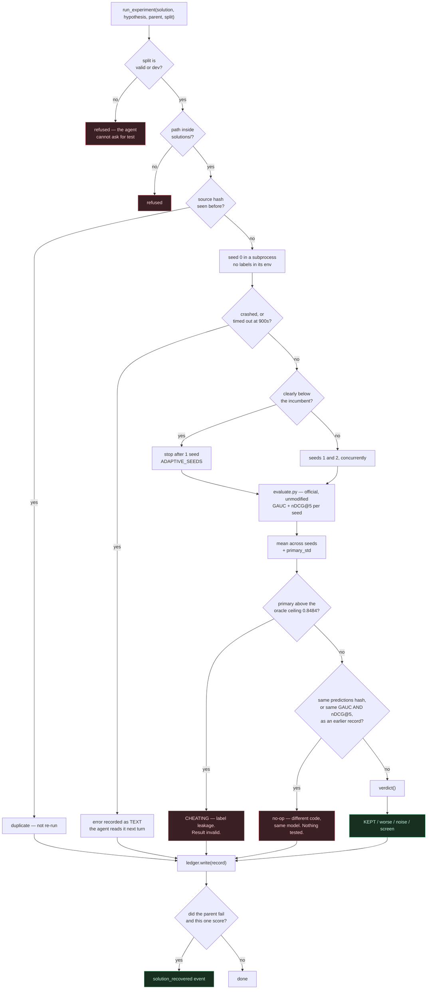
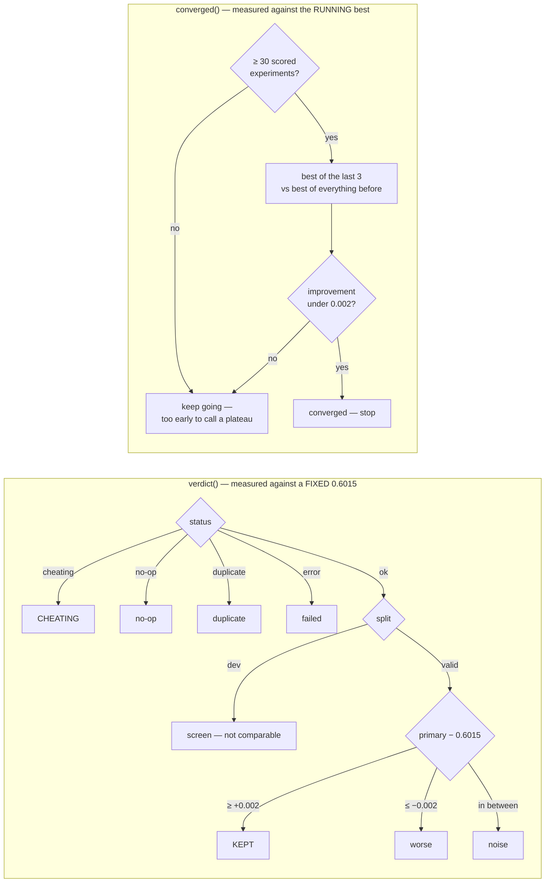
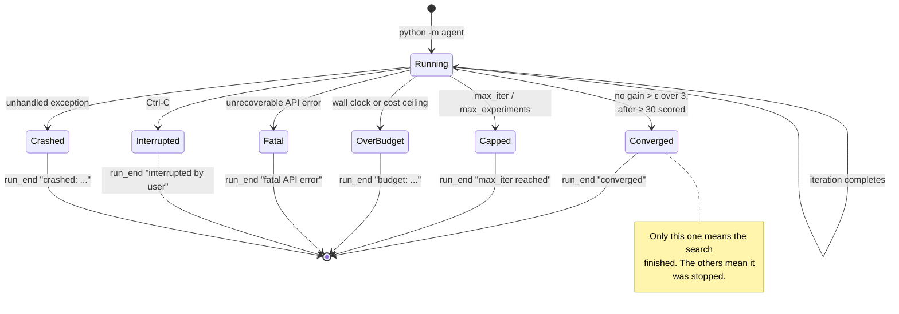
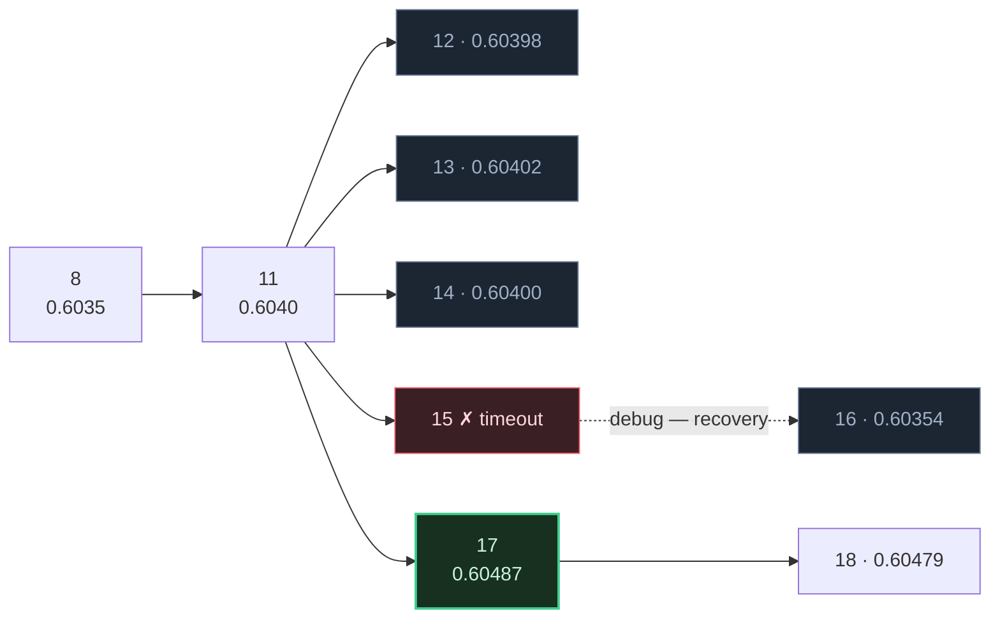
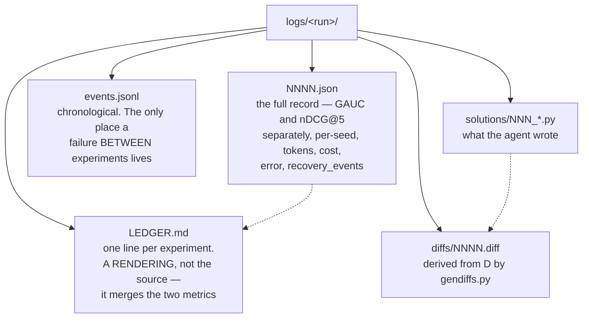

# Architecture

How the agent, the harness and the run record fit together. Every diagram below
is drawn from the code named in it, not from a design document — if the two
disagree, the code is right and this file is stale.

Mermaid renders natively on GitHub and in Devpost's markdown, so these blocks
can be pasted straight into a writeup.

---

## 1. The whole system

The important line in this picture is the one between `agent/` and `harness/`.
The agent writes solutions and asks for them to be scored; it never holds a
label, never computes a metric, and never sees the test split. That separation
is mechanical, not prompted.

**The agent has exactly five tools** ([tools.py](../agent/tools.py)):
`read_ledger`, `read_solution`, `write_solution`, `run_experiment`, `web_search`.
There is no edit tool and no shell.

---

## 2. One iteration

The agent has no memory between iterations. Each turn is rebuilt from disk —
which is why a killed run can be restarted and resume knowing everything.

**API failure is not run failure.** A retryable error backs off and retries up
to `MAX_API_RETRIES`; a fatal one (bad key, malformed request) stops the run
rather than burning the budget on a call that will fail identically forever.
Abandoning an *iteration* is not abandoning the *run* — the ledger holds
everything learned, so the next turn rebuilds from disk.

---

## 3. What `run_experiment` actually does

This is the part that has to be untrickable. Note the order: the guards come
before anything is executed.

**One seed failing fails the experiment.** Averaging the seeds that happened to
work is not a measurement of anything, and it would hide a solution that breaks
one time in three.

---

## 4. Verdict vs convergence — two different questions

These are easy to conflate and they must not be. `verdict()` asks *"did this
beat the published baseline?"*; `converged()` asks *"has the search stopped
making progress?"*. Reusing the first for the second breaks the run: once the
agent clears the target, every result is `KEPT` forever and convergence can
never fire.

The 30-experiment floor is ours, not the organisers'. Taken literally the stated
rule fires at iteration 4, because three non-improvements in a row is simply
what the start of a search looks like — every run was stopping before it found
anything. The organisers confirmed a team may set its own ε, N and minimum floor
provided they are fixed before the run and recorded in the log. Ours are written
into every `run_start` event.

---

## 5. How a run ends

Across the 26 recorded `run_end` events: **17 converged**, 4 hit `max_iter`,
2 were interrupted, 2 hit a budget ceiling, 1 crashed. `run_end` always carries
the reason, so a truncated run can never be mistaken for a finished one.

---

## 6. The search is a tree, not a list

Every record names a `parent`, and each hypothesis opens with `draft`,
`improve` or `debug` — so the record holds both the edge and the intent behind
it. This is what lets the agent abandon a line and return to an earlier one.

Real, from `logs/record-run-12`. Node 11 has five children. 12, 13 and 14 were
blend-weight tweaks that came in at −0.000058, −0.000018 and −0.000040 against
seed noise of 0.0008 — three iterations that resolved nothing. 15 was a new
mechanism that timed out; 16 rescued the idea but landed below 11. So when 17
was drafted, **11 was still the best node and that is where it branched from.**
A list-shaped search would have continued from 16 and carried a worse incumbent
forward.

Selection is UCT, scaled by the organisers' epsilon rather than by the observed
range — so seed noise cannot reorder the ranking. It is advisory: the agent
still names its own parent, and `run.py` records where that choice ranked.

---

## 7. What ends up on disk

Anything reasoning about *how* a result moved needs the JSON: GAUC and nDCG@5
routinely move in opposite directions and the merged `primary` hides it. The
agent's own best result came from noticing exactly that.

---

## Regenerating the diagrams

Nothing here is generated — they are hand-drawn from the code and go stale if
the code moves. The parts most worth re-checking after a change:

| diagram | check against |
| --- | --- |
| 2, one iteration | `run_loop()` in [loop.py](../agent/loop.py) |
| 3, the pipeline | `run_experiment()` in [run.py](../harness/run.py) |
| 4, verdict / convergence | `verdict()` and `converged()` in [ledger.py](../harness/ledger.py) |
| 5, how a run ends | the `run_end` details in any `events.jsonl` |
